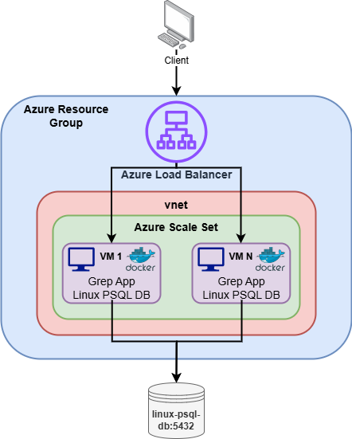
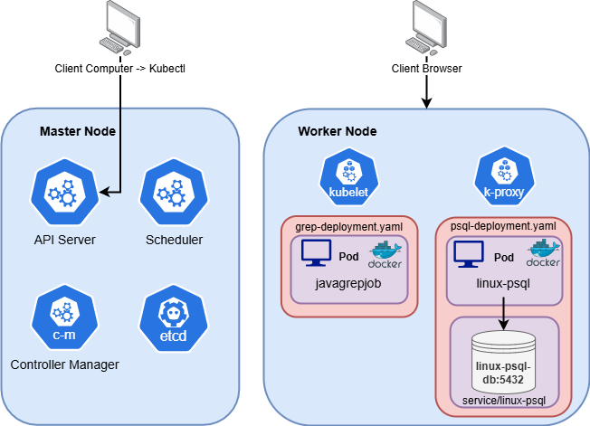
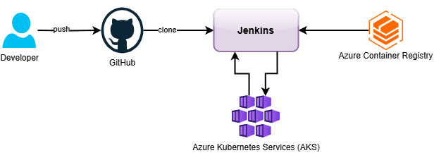

# Cloud & DevOps Project
# Introduction
This project focuses on migrating the execution of a Java Grep Application and the Linux Cluster Monitoring Agent PostgreSQL database from an on-premises setup to the Cloud. Microsoft Azure was utilized to host a Virtual Machine (VM) running the Docker containers for both applications. A container image was then created from this VM to deploy multiple instances of the VM, with a load balancer managing the incoming traffic to the VMs. To support elasticity, Azure Scale Sets were utilized to adjust the number of VMs based on demand automatically. For improved scalability and container orchestration, Azure Kubernetes Service (AKS) was utilized to run the applications using Kubernetes. Separate Development and Production environments were configured to streamline deployment stages. Finally, Jenkins was used to automate the deployment process, as part of the CI/CD pipeline, and Git was used for version control.

# Application Architecture
- Azure VM Deployment using Load Balancer, Scale Sets, and Vnet Diagram:

- Kubernetes Cluster Deployment Diagram:

# Jenkins CI/CD pipeline
- Jenkins is used to automate the application deployment process, enhancing the speed and reliability of application delivery.
- The CI/CD pipeline begins by fetching the application code from GitHub by cloning the repository.
- During the build stage, a new Azure Container Registry (ACR) image will be created using the Dockerfile of the application and then pushed to ACR.
- In the testing stage, the status of the ACR image and Kubernetes cluster will be checked to ensure they are functioning as expected.
- In the deploy stage, Jenkins triggers a pipeline job that logs on to Azure CLI, connects to the AKS cluster, and uses Kubectl commands to deploy the new version of the application to the cluster.
- Jenkins Pipeline Diagram:

# Improvements
In the future, I would like to make the following improvements to further improve the efficiency of the project:
- Modify the Jenkins CI/CD setup to execute the files after a change to the GitHub repository and email the users after an unsuccessful build or deployment.
- Strengthening the security for AKS and ACR by setting network policies.
- Perform occasional probes on the deployed clusters to check for readiness and liveness.
