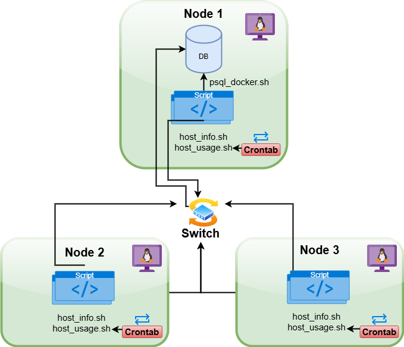

# Linux Cluster Monitoring Agent
# Introduction
The Linux Cluster Monitoring Agent project implements a Minimum Viable Product (MVP) that helps the Linux Cluster Administration (LCA) team at Jarvis manage a Linux Cluster. The LCA team requires the hardware specifications, and the real-time resource usage of each node/monitor in the cluster. This project helps the LCA team meet business needs through creating a PostgreSQL database instance inside a Docker container to store the hardware specifications and the resource usage information of all the nodes. Additionally, a bash agent has been used to collect the server usage information periodically and store this information in a psql database, and git has been used for version control. 

# Quick Start
## 1. Start a psql instance using `psql_docker.sh` shell script
Command to create a docker container instance if it doesn't exist:
```
bash -x ./linux_sql/scripts/psql_docker.sh create postgres password
```

Command to start the psql instance inside of docker container:
```
bash -x ./linux_sql/scripts/psql_docker.sh start
```

Command to stop the psql instance inside the docker container:
```
bash -x ./linux_sql/scripts/psql_docker.sh stop
```

## 2. Create tables using `ddl.sql` script
Command to execute the `ddl.sql` script:
```
psql -h localhost -U postgres -d host_agent -f linux_sql/sql/ddl.sql
```

## 3. Insert hardware specifications data into the host agent database using `host_info.sh` script
Command to execute the `host_info.sh` shell script:
```
bash -x ./linux_sql/scripts/host_info.sh localhost 5432 host_agent postgres password
```

## 4. Insert hardware usage data into the host agent database using `host_usage.sh` script
Command to execute the `host_usage.sh` shell script:
```
bash -x ./linux_sql/scripts/host_usage.sh localhost 5432 host_usage postgres password
```

## 5. Crontab Setup
Obtain the complete path of the `host_usage.sh` script:
```
pwd
```

Edit the crontab jobs on your Linux system:
```
crontab -e
```

Insert the following command to execute the `host_usage.sh` file every minute
```
* * * * * bash /home/centos/dev/jrvs/bootcamp/linux_sql/host_agent/scripts/host_usage.sh localhost 5432 host_agent postgres password > /tmp/host_usage.log
```

# Implementation
The Linux Cluster Monitoring Agent project has been implemented by utilizing bash scripts and a PSQL database. Firstly, bash scripting is used to create a Docker container to containerize the PSQL instance. A Docker volume was also created and linked to the docker container in the same script to ensure the data stored in the PSQL database is persisted even if the container is stopped or deleted. The `ddl.sql` file was created to connect to the `host_agent` database in psql, and `host_info`, `host_usage` tables were created to store the usage information for all the nodes in the cluster. Following this, the `host_info.sh` and `host_usage.sh` bash scripts are created to store the system hardware specifications and memory usage information. Finally, crontab is used to execute the `host_usage.sh` script every minute and store this information in the `host_usage` table in `host_agent` psql database.   

## Architecture
The architecture of this project can be seen in the image below:


## Scripts
Description of `psql_docker.sh` shell script
```
- Allows users to Create/Start/Stop a Docker instance to assist with connecting to a PSQL database for this project
- The script expects three command line arguments when executed:
	- $1: [Create | Start | Stop] #Action you want to perform on the Docker container
	- $2: PostgreSQL_Username #Used to set the username when creating the PSQL instance
	- $3: PostgreSQL_Password #Used to set the password when creating the PSQL instance
```

Description of `host_info.sh` shell script
```
- Collects the system hardware specifications to store them in the host_info table in the PSQL database
- The script expects five command line arguments when executed:
	- $1: Hostname
	- $2: Port number
	- $3: PSQL database name
	- $4: PSQL username
	- $5: PSQL password
- The script is only run once as the hardware specifications are not expected to change.
```

Description of `host_usage.sh` shell script
```
- Collects the current system memory usage information and stores it inside the host_usage PSQL database
- This script expects the same five command line arguments as `host_info.sh` when executed
- This script is expected to be automatically executed every minute as the memory usage information is changing every minute based on the processes running on the system. 
```

Description of `ddl.sql` script
```
- Connects to the host_agent database
- Creates the host_info and host_usage tables if they don't already exist in the database
- Displays the current tables in the database
```

Description of `queries.sql` script
```
- Connects to the host_agent database
- Analyzes key information regarding the functioning of the Linux clusters by computing the average memory usage every 5 minutes, and trying to detect host failures based on the number of entries by crontab within a 5-minute interval.
```

Description of Crontab
```
- Crontab command on Linux is used to automatically execute the `host_usage.sh` script every minute.
- Adding the `* * * * *` command before executing the bash command in crontab ensures that the script is executed every minute.
```

## Database Modeling
- Schema of `host_info` table

| Column Name | Data Type | Constraint | Description |
|-------------|-----------|------------|-------------|
| id | SERIAL | Primary Key | ID assigned to the host machine |
| hostname | VARCHAR | Unique; NOT NULL | Name of the Host machine |
| cpu_number | INT2 | NOT NULL | Number of CPU's in the host machine |
| cpu_architecture | VARCHAR | NOT NULL | Type of CPU Architecture |
| cpu_model | VARCHAR | NOT NULL | CPU Model Information |
| cpu_mhz | FLOAT8 | NOT NULL | Clock speed of CPU in MHz  |
| l2_cache | INT4 | NOT NULL | Size of Level 2 CPU Cache |
| timestamp | TIMESTAMP | | Time the data is obtained |
| total_mem | INT4 | | Total memory available on the host |

- Schema of `host_usage` table

| Column Name | Data Type | Constraint | Description |
|-------------|-----------|------------|-------------|
| timestamp | TIMESTAMP | NOT NULL | Time the data is obtained |
| host_id | SERIAL | Foreign Key; References `id` in host_info | Referencing the host ID this memory usage data belongs to |
| memory_free | INT4 | NOT NULL | Unused memory (MB) in host at this time |
| cpu_idle | INT2 | NOT NULL | Percentage of CPU that is idle |
| cpu_kernel | INT2 | NOT NULL | Percentage of CPU time spent in Kernel |
| disk_io | INT4 | NOT NULL | Number of disk I/O operations |
| disk_available | INT4 | NOT NULL | Available disk space (MB) |

# Test
- The script `psql_docker.sh` has been tested by providing different valid inputs to create, start, and stop the docker containers. Additionally, invalid parameters and an incorrect number of parameters were also provided to the script to ensure it can handle incorrect inputs and inform the users that the input is invalid.
- The script `ddl.sql` has been tested by running it when the `host_info` and `host_usage` psql tables were already created in the database, to ensure the tables are only created when they don't exist.
- Additionally, sample insert statements were also made for both `host_info` and `host_usage` tables to check that the tables are functioning as expected and the foreign key relationship between both tables has been established. Following this, these sample inputs were then deleted.
- The efficiency of Crontab was tested by manually establishing a psql instance, and connecting to the `host_agent` database, and displaying all of its rows in the terminal to ensure new rows are being added every minute.

# Deployment
- This project has been deployed using GitHub, Crontab, and Docker.
- Docker has been utilized for running an instance of the PostgreSQL database as a container.
- Crontab has been utilized to automate the process of running the `host_usage.sh` script every minute, in order to obtain host system usage information periodically.
- GitHub has been utilized for source code management, and hosting the local Git repository in the cloud.

# Improvements
- Clean up the logs for `host_usage` periodically, so that old logs are not stored for too long and reduce the storage being used by the logs.
- Perform analysis of the system's health after each week to inform users regarding the system's resource usage over the week, and notify users if there are any anomalies.
- Perform analysis of which nodes are the busiest in terms of memory usage using SQL scripts.

