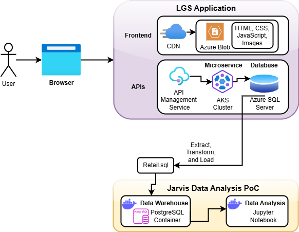

# Introduction
This project has been developed for a UK-based client London Gift Shop (LGS). The client has reached out to the development team at Jarvis to perform data analysis on their retail data and submit a Proof of Concept (PoC). The LGS marketing team aims to utilize this information to gain a deeper understanding of their customer's behavior and use it to design targeted marketing campaigns. A PostgreSQL database has been created using a Docker container and is used as the Data Warehouse by importing the retail information provided by the client. For performing data analysis, a Jupyter Notebook was created using a Docker container, and internally Pandas, NumPy, and Matplotlib libraries were used to clean, load, transform, and visualize the data. Analysis was performed to identify different trends and patterns present in the data like the monthly sales information, and the number of new users added each month. Git was used for version control.

# Implementaion
## Project Architecture
LGS is an online website, and they utilized Azure SQL Server as their backend in the API stack. It is responsible for storing all the real-time retail information. For this project, the LGS team created an SQL dump of their retail data from December 1, 2009, to December 9, 2011. As part of the ETL process, they removed the client's personal information. For performing the analysis, a PostgreSQL database has been created using a Docker container. For the data wrangling process, a Docker container has been created for Jupyter Notebook.

## Architecture Diagram


## Data Analytics and Wrangling
- The data analysis performed for this project can be accessed in the Jupyter Notebook in this location: [Retail Data Analytics Notebook](python_data_wrangling/retail_data_analytics_wrangling.ipynb)
- The PoC for this project focused on identifying key trends in LGS sales performance, such as the number of new customers added each month, monthly sales, total orders and cancellations each month, and RFM segmentation.
- These insights provide the LGS marketing team with a strong foundation to design target marketing campaigns to improve sales. Based on the trends, they can focus on areas such as:
```
- The LGS marketing team can come up with new ideas to encourage sales in months that contain the fewest overall sales numbers (eg. January, February).
- Create personalized sections for the customers, using their past purchase behavior. This will enhance user experience and could potentially lead to better purchase rates.
- Investigate the reasons for high cancellations in peak months (eg. November, December), and try to improve the service to improve customer satisfaction.
- Develop new strategies to encourage new members to purchase items at LGS.
```

# Improvements
In the future, I would like to make the following improvements for a more in-depth analysis of the data:
- Develop Machine learning models using historical data, to predict sales trends and customer behavior in the future.
- Spend more time learning RFM, to better cluster users based on their purchase behavior.
- Perform deeper analysis to identify customer location patterns, and investigate potential correlations between a customer's spending behavior and time of the year.
